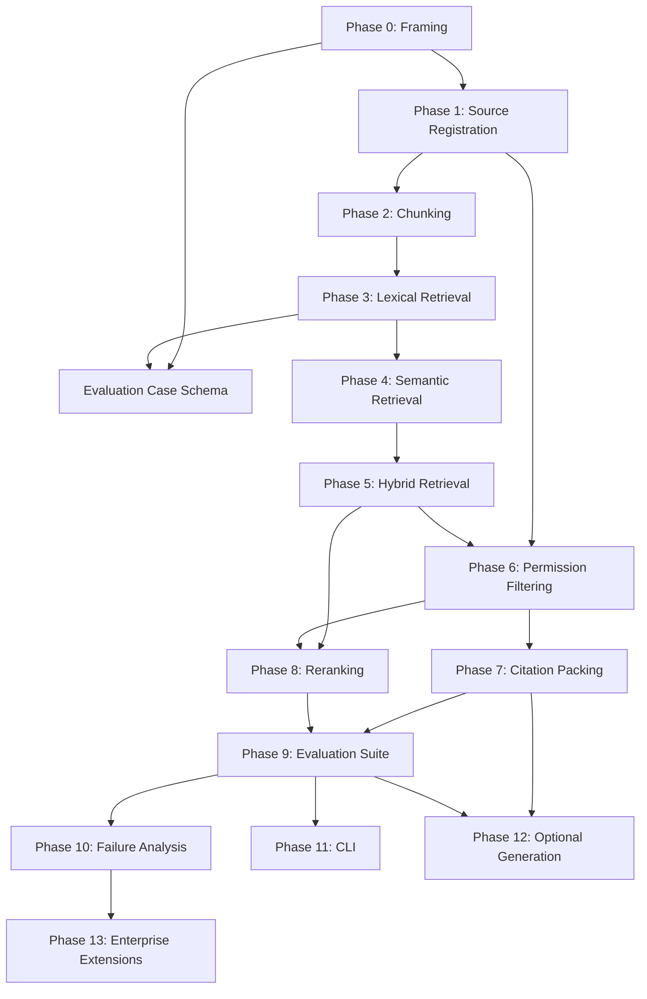

# Development Plan

## Purpose

This document consolidates the GroundSeal RAG roadmap, task inventory, and design contracts into an executable development plan. It tells future agents and collaborators what to build, in what order, with what artifacts, and how to know each step is complete.

## Current State

| Item | Status |
|------|--------|
| Phase | 0 — Framing and Contracts |
| Code | None (by design) |
| Core docs | Present: brief, architecture, permission, citation, evaluation, failure analysis |
| Task inventory | Mapped in `TASKS.md` |
| Open questions | Collected in `docs/open-questions.md` |

Phase 0 is nearly complete. Remaining Phase 0 work is consistency review and a phase checklist template. Phase 1 document work can begin in parallel once Phase 0 exit criteria are met.

## Project Identity Constraints

Every development step must preserve these boundaries:

1. **Retrieval-first** — evidence selection before any generation layer.
2. **Permission-aware** — access scope is part of candidate eligibility, not a UI rule.
3. **Citation-first** — citations are retrieval output, not post-hoc decoration.
4. **Evaluation-first** — baselines and repeatable cases before complexity.
5. **Small phase exits** — each phase leaves inspectable artifacts and findings.

Prohibited until the roadmap calls for them: chatbot UI, broad API surfaces, model provider integration, empty package scaffolding, unmeasured feature growth.

## Dependency Graph

Key dependency rules:

- Do not implement retrieval before source, document, and chunk contracts exist.
- Do not add semantic retrieval before lexical baseline is measured.
- Do not add hybrid retrieval before both baselines exist.
- Do not add generation before permission filtering and citation packing are evaluated.
- Permission false allow is a **blocking failure** for citation and generation work.

## Phase-by-Phase Plan

### Phase 0: Framing And Contracts (current)

**Goal:** Stable project identity, agent rules, and document set.

**Remaining tasks:**

| Task | Output | Exit criterion |
|------|--------|----------------|
| Consistency review | Edits to README, brief, roadmap, rules | No contradictions across positioning docs |
| Phase checklist template | Template under `notes/` or `reports/` | Future sessions can record goal, hypothesis, artifacts, findings, next steps |

**Exit:** Documents agree on scope; tasks mapped to phases; no implementation code.

---

### Phase 1: Source Registration And Ingestion Plan

**Goal:** Every document traceable to a registered source with permission and citation metadata.

**Document-first tasks:**

1. Define source metadata contract (source identity, ownership, permission scope, freshness, citation fields).
2. Draft normalized document record examples (non-executable).
3. Write ingestion assumptions note (boundaries, what metadata must survive normalization).

**Implementation (after contract approval):**

- Minimal source registry that lists registered sources with required metadata.

**Evaluation:**

- Every document traces to a source.
- Permission and citation metadata are preserved through ingestion design.

**Exit:** Source and document field definitions are stable; ingestion boundaries are clear.

**Open decisions:** First corpus source types; freshness representation.

---

### Phase 2: Chunking Baseline

**Goal:** Stable chunk identity with citation-ready boundaries.

**Document-first tasks:**

1. Chunk record contract (chunk_id, document_id, source_id, boundaries, metadata).
2. Baseline strategy note (size, overlap, boundary rules, table/list handling).
3. Good and bad chunk boundary examples.

**Implementation (after examples):**

- Minimal chunking module producing stable identifiers and source references.

**Evaluation:**

- Chunks preserve source and document identity.
- Boundaries are inspectable; citation precision vs context tradeoff is documented.

**Exit:** One baseline strategy selected; known tradeoffs recorded.

---

### Phase 3: Lexical Retrieval Baseline

**Goal:** First explainable sparse/exact retrieval baseline.

**Prerequisites:** Chunk inventory or chunk examples; initial query cases (can start in Phase 9 schema).

**Document-first tasks:**

1. Lexical retrieval contract and candidate output format.
2. Initial query cases (exact terms, IDs, policy labels).
3. Expected metrics and failure categories.

**Implementation:**

- Minimal lexical retriever returning traceable candidate records.

**Evaluation:**

- Exact-term queries retrieve expected evidence.
- Candidate records include source, document, chunk, method, score, permission placeholder.

**Exit:** Baseline metrics or expected metrics recorded; failure categories identified.

---

### Phase 4: Semantic Retrieval Baseline

**Goal:** Meaning-based retrieval for paraphrase and conceptual queries.

**Prerequisites:** Lexical baseline measured; same query set available.

**Document-first tasks:**

1. Embedding decision note (model choice criteria, local vs API tradeoffs).
2. Semantic candidate contract.
3. Lexical vs semantic comparison query set.

**Implementation:**

- Minimal semantic retriever with documented dependency choice.

**Evaluation:**

- Paraphrase cases improve where expected.
- Exact-identifier regressions are visible and recorded.

**Exit:** Semantic strengths and weaknesses documented; dependency justified.

---

### Phase 5: Hybrid Retrieval

**Goal:** Measured combination of lexical and semantic candidates.

**Prerequisites:** Both baselines evaluated on the same cases.

**Document-first tasks:**

1. Merge strategy design (rank fusion, weighted scoring, cutoffs).
2. Deduplication rules.
3. Experiment hypothesis.

**Implementation:**

- Hybrid candidate merger.

**Evaluation:**

- Hybrid improves selected cases or documents clear tradeoffs.
- Duplicate and noise rates tracked.

**Exit:** Selected merge strategy documented; baseline comparison complete.

---

### Phase 6: Permission-Aware Filtering

**Goal:** Unauthorized evidence never enters final context.

**Prerequisites:** Permission metadata on sources/documents/chunks; requester context model.

**Document-first tasks:**

1. Finalize permission metadata fields.
2. Requester context model.
3. Permission test matrix: full access, limited access, no access, mixed, missing metadata.

**Implementation:**

- Permission filter applied after retrieval, before citation packing.

**Evaluation:**

- Zero unauthorized evidence in top-k (blocking).
- Allowed recall measured separately from global recall.
- False deny cases recorded.

**Exit:** Permission behavior is testable; safe default for missing metadata is documented.

---

### Phase 7: Citation Packing

**Goal:** Citation-ready evidence packages under a context budget.

**Prerequisites:** Permission-filtered candidates; chunk and citation contracts.

**Document-first tasks:**

1. Citation output contract with packed evidence examples.
2. Packing strategy (diversity vs strength, redundancy handling, budget rules).

**Implementation:**

- Citation packer producing traceable packages.

**Evaluation:**

- Selected evidence remains source-traceable.
- No inaccessible citation leakage.
- Redundant citation rate tracked.

**Exit:** Citation package stable enough for downstream use; failure categories defined.

---

### Phase 8: Reranking

**Goal:** Evidence-driven reordering of allowed candidates.

**Prerequisites:** Baseline ranking failures categorized; permission filtering stable.

**Document-first tasks:**

1. Reranking hypothesis tied to observed ranking failures.
2. Cost and dependency note.
3. Comparison setup.

**Implementation:**

- Reranker integration or local baseline (only if hypothesis is supported).

**Evaluation:**

- Ranking metrics improve on meaningful cases.
- Permission and citation behavior do not regress.

**Exit:** Reranking accepted, rejected, or deferred with evidence.

---

### Phase 9: Retrieval Evaluation Suite

**Goal:** Repeatable measurement across retrieval, permissions, and citations.

**Note:** Evaluation case schema work can start during Phase 0/1. Full suite matures as retrieval layers are added.

**Artifacts:**

- Query case schema (query, requester context, expected evidence, inaccessible evidence, citation expectations).
- Gold evidence set for small corpus.
- Metric definitions (recall@k, allowed recall, citation coverage, unauthorized leakage).
- Report format under `reports/`.

**Implementation:**

- Evaluation runner (after enough retrieval behavior exists).

**Exit:** Evaluation can be run after retrieval changes; results produce actionable follow-ups.

---

### Phase 10: Failure Analysis Workflow

**Goal:** Failures become categorized, actionable findings.

**Artifacts:**

- Failure taxonomy (already drafted in `docs/failure-analysis-plan.md`).
- Failure record template in `reports/`.
- Workflow: evaluate → categorize → record → one targeted change → re-run.

**Exit:** Evaluation failures consistently produce documented action items.

---

### Phase 11: CLI Surface

**Goal:** Repeatable local experiments without building an app.

**Prerequisites:** Core retrieval path and evaluation suite exist.

**Scope:**

- Commands for indexing, retrieval, evaluation, reporting.
- Inputs and outputs preserve traceability.

**Exit:** CLI improves workflow without becoming a product UI.

---

### Phase 12: Optional Generation Layer

**Goal:** Grounded answers that consume citation packages without bypassing retrieval.

**Prerequisites:** Retrieval, permission filtering, citation packing, and evaluation are trustworthy.

**Constraints:**

- Generator must not retrieve independently.
- Unsupported claims must be detectable.
- Insufficient evidence behavior must be defined.

**Exit:** Generation adds value without hiding retrieval defects.

---

### Phase 13: Enterprise-Oriented Extensions

**Goal:** Realistic extensions with documented tradeoffs.

**Candidates:** Multi-tenant permissions, freshness tracking, audit logs, connector abstractions, role-specific evaluation sets.

**Rule:** Each extension requires proposal, risk analysis, and evaluation plan before implementation.

## Immediate Execution Sequence

The next work sessions should follow this order:

### Session group A — Close Phase 0

1. Run consistency review across README, `PROJECT_BRIEF.md`, roadmap, agent rules, and design docs.
2. Create phase checklist template for `notes/` or `reports/`.
3. Mark Phase 0 exit criteria complete in a phase summary report.

### Session group B — Start Phase 1 (documents only)

1. Define source metadata contract → design note.
2. Draft document record and ingestion examples.
3. Decide first corpus source types (small, permission-diverse, citation-friendly).

### Session group C — Parallel evaluation prep

1. Define evaluation case schema in `docs/evaluation-plan.md`.
2. Draft 5–10 seed query cases (no code required) covering exact match, paraphrase, permission deny, and missing metadata.

### Session group D — Phase 2 prep (after Phase 1 contracts)

1. Chunking strategy note with size, overlap, and boundary rules.
2. Good/bad chunk examples tied to citation precision goals.

## Per-Phase Work Loop

Every phase follows the same loop from `docs/execution-rhythm.md`:

1. Scope the phase and confirm exit criteria.
2. Update relevant design documents.
3. Add examples or evaluation cases.
4. Implement only if the phase calls for it and contracts are approved.
5. Evaluate or review against baselines.
6. Record findings in `reports/` or `notes/`.
7. Update `TASKS.md` and `docs/open-questions.md`.

## Milestone Definitions

| Milestone | Phases | Resume relevance |
|-----------|--------|------------------|
| **M1: Contracts complete** | 0–1 docs | Shows disciplined system design |
| **M2: Retrieval baseline** | 2–3 impl | Working lexical path with evaluation |
| **M3: Hybrid retrieval** | 4–5 impl | Baseline comparison and tradeoff reports |
| **M4: Permission-safe context** | 6–7 impl | Access-scoped citation packages |
| **M5: Evaluation-driven system** | 8–10 | Repeatable suite and failure taxonomy |
| **M6: Resume-ready** | 11 + reports | CLI, hybrid, permissions, citations, documented failures |
| **M7: Full stack (optional)** | 12–13 | Grounded generation with enterprise extensions |

Minimum resume scope (from `docs/resume-scope.md`): M2 plus citation-ready output, small evaluation set, and failure analysis.

Recommended resume scope: M4 plus hybrid comparison and permission evaluation matrix.

## Risk Register

| Risk | Mitigation |
|------|------------|
| Drift toward chatbot demo | Return to `PROJECT_BRIEF.md` and design principles; block generation until Phase 12 |
| Anonymous ingestion | Phase 1 source contract is blocking for all retrieval work |
| Permission false allow | Blocking failure; stops citation and generation phases |
| Hybrid without baselines | Phase 5 gated on Phase 3 and 4 reports |
| Evaluation happy-path only | Seed cases must include deny, missing metadata, and ambiguous relevance |
| Code without conclusions | Every implementation session must produce metric, failure category, or design correction |
| Over-scaffolding | Dependencies must earn their place per design principle 8 |

## Success Criteria For The Full Project

The project succeeds when it can answer, with evidence:

- Which sources are registered and what metadata they carry.
- Which chunks are eligible for a query and requester.
- Which retrieval method produced each candidate and why it ranked there.
- Which candidates were denied and why.
- Which citations were packed and whether they support downstream answers.
- Which queries fail, in which category, and what change is proposed next.

## Document Maintenance

Update this plan when:

- a phase completes and exit criteria are met
- the roadmap adds or reorders phases
- evaluation findings change priorities (e.g., chunking failures pause retrieval expansion)
- open questions are resolved and become design decisions

Related documents: `docs/roadmap.md`, `TASKS.md`, `docs/execution-rhythm.md`, `docs/open-questions.md`.
